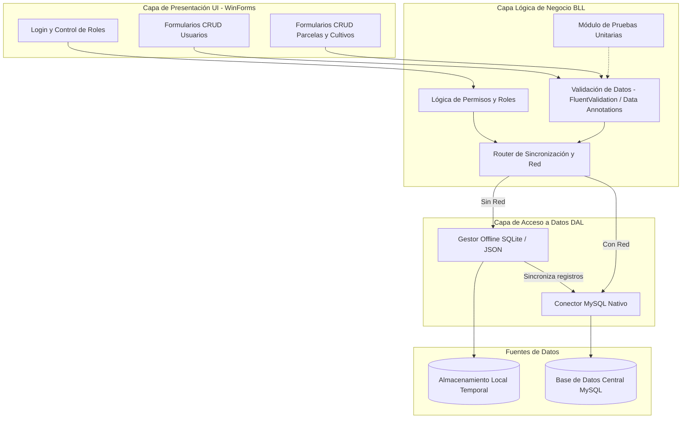

# Especificación Técnica y de Requerimientos: AgroTech SmartFields

Este documento detalla los requerimientos funcionales, las operaciones lógicas y la arquitectura de software recomendada para el proyecto **AgroTech SmartFields**. Ha sido diseñado específicamente para garantizar la cobertura total de las pautas de evaluación del **Hito 2 de la Etapa 1**, asegurando el cumplimiento de los estándares de especialidad técnica (**CE2N2**) y empleabilidad (**CEMN2**) para calificar al nivel **Sobresaliente**.

---

## 1. Matriz de Cobertura: Rúbrica vs. Implementación

Para asegurar la calificación máxima, cada componente del software se mapea directamente con los criterios de evaluación de la rúbrica institucional:

| Criterio de la Rúbrica (Nivel Sobresaliente) | Requisito del Proyecto | Mapeo en el Software e Implementación |
| :--- | :--- | :--- |
| **CE2N2 - Condiciones del Proceso:** "Programa el prototipo considerando requerimientos, resolviendo la problemática, identificando errores y realizando pruebas rigurosas." | Resolver el control agrícola de hortalizas y evitar registros manuales. | Aplicación de escritorio nativa conectada a **MySQL**, con manejo del flujo alterno offline para evitar la pérdida de datos y un sistema robusto de captura de excepciones en cada capa. |
| **CE2N2 - Desempeño Acciones:** "Desarrolla el software usando componentes gráficos de aplicación, generando documentación interna y externa, y construyendo pruebas unitarias." | Interfaz de escritorio, código comentado y pruebas de componentes. | Interfaz en **C# Windows Forms (con diseño moderno o Material Design)**, uso de librerías de validación como **FluentValidation**, comentarios estructurados (XML docs) y módulo de pruebas unitarias en la capa lógica (**BLL_Test**). |
| **CE2N2 - Cumplimiento de Estándares:** "Presenta la lógica desarrollada, satisface las necesidades de clientes, aplica estándares de documentación y garantiza alta calidad de código y arquitectura." | Estructura del programa organizada y de nivel industrial. | Implementación de **Arquitectura de 3 Capas (N-Tier)**: Presentación (UI), Lógica de Negocio (BLL) y Acceso a Datos (DAL). Esto aísla la lógica para facilitar pruebas independientes y el mantenimiento. |
| **CEMN2 - Empleabilidad (Resolución de Problemas y Trabajo Colaborativo):** Ponderación del 30% mediante el Informe Reflexivo grupal. | Proceso deductivo, metas claras, comunicación asertiva y coordinación. | Registro del avance en la bitácora técnica, asignación clara de roles en la arquitectura de 3 capas y desarrollo del informe con 3 causas, acciones preventivas y beneficios de coordinación. |

---

## 2. Especificación Operativa de Requerimientos Funcionales

### RF-01: Registro y CRUD de Parcelas y Cultivos
* **Actor:** Encargado de Producción (debe estar previamente autenticado en el sistema).
* **Descripción:** Permite centralizar los datos de producción agrícola para reemplazar los registros en papel de los invernaderos ubicados en Maule y Ñuble.

#### Datos a Capturar y Componentes Gráficos en UI:
* **Datos de la Parcela:**
  * **Nombre de la Parcela:** Campo de texto (`TextBox`), ejemplo: *"Invernadero Norte 1"*.
  * **Ubicación:** Campo de texto o selección (`ComboBox`), restringido a *"Maule"* y *"Ñuble"*.
  * **Dimensiones (m²):** Control numérico (`NumericUpDown`) que impida valores inferiores a 1 de forma visual.
* **Datos del Cultivo Asociado:**
  * **Tipo de Cultivo:** Control de selección (`ComboBox`), alimentado dinámicamente desde la base de datos (ej. tomates, lechugas, zanahorias).
  * **Fecha de Siembra:** Selector de fecha (`DateTimePicker`).
  * **Fecha Estimada de Cosecha:** Selector de fecha (`DateTimePicker`).

#### Reglas de Negocio y Validación en BLL:
1. **Validación de Dimensiones:** El m² debe ser estrictamente mayor a 0.
2. **Validación de Fechas:** La fecha de siembra no puede ser posterior a la fecha actual, y la fecha estimada de cosecha debe ser posterior a la fecha de siembra.
3. **Mapeo de Integridad:** Cada cultivo debe pertenecer de forma obligatoria a una parcela registrada y válida en la base de datos.

#### Flujos de Operación:
* **Flujo Normal (Conexión Activa):** 
  1. El Encargado de Producción ingresa los datos en el formulario.
  2. La UI pasa los datos a la capa lógica (BLL) como un objeto inmutable (`record`).
  3. La BLL valida los datos. Si son válidos, invoca la capa de acceso a datos (DAL).
  4. La DAL ejecuta un comando `INSERT` parametrizado en la base de datos MySQL.
  5. La base de datos guarda la información y la UI muestra un diálogo de confirmación exitoso al usuario.
* **Flujo Alterno (Modo Offline - Sin Conexión):**
  1. Si la DAL detecta que la base de datos MySQL no está disponible (captura de excepción `MySqlException`), el sistema activa el **Modo de Contingencia**.
  2. La DAL almacena temporalmente el registro en un archivo JSON local o en una base de datos local ligera (**SQLite**).
  3. El sistema muestra una alerta en la UI indicando: *"Registro guardado localmente debido a falta de conexión. Se sincronizará automáticamente al detectar red"*.
* **Flujo de Sincronización (Restablecimiento de Red):**
  1. Al iniciar la aplicación o de forma periódica en segundo plano, la BLL verifica la conectividad con MySQL.
  2. Si se restablece la red, se leen los registros del almacenamiento local temporal.
  3. Se migran uno a uno hacia la base de datos central en MySQL respetando la consistencia y relaciones de datos.
  4. Se limpian los registros temporales locales ya sincronizados.
* **Excepciones:**
  * Si se detectan dimensiones de parcela negativas o nulas, o si la fecha de cosecha es inconsistente, la BLL arroja una excepción de validación. La UI captura este evento y muestra un mensaje de alerta solicitando la corrección inmediata antes de intentar guardar.

---

### RF-02 / RF-03: Gestión y Autenticación de Usuarios
* **Actor:** Administrador del Sistema / Todos los Usuarios (en el Login).
* **Descripción:** Controla el acceso a la aplicación de escritorio y restringe las funcionalidades según el rol laboral de cada integrante de la empresa.

#### Operaciones Principales:

#### 1. Formulario de Autenticación (Login):
* **Componentes:** Campos para usuario y contraseña (`TextBox`), y botón de ingreso.
* **Operación:** Compara las credenciales encriptadas ingresadas con los registros de la base de datos MySQL.
* **Control de Accesos por Roles:** El sistema identifica el rol asignado al usuario y expone únicamente las vistas o pestañas permitidas:
  * **Administrador:** Acceso completo al sistema, incluyendo la creación, modificación y eliminación de usuarios.
  * **Encargado de Producción:** Acceso al registro y CRUD de parcelas y cultivos.
  * **Supervisor / Trabajador:** Vistas de solo lectura o restricciones según el módulo.

#### 2. CRUD Completo de Usuarios (Acceso Exclusivo de Administradores):
* **Crear Usuario:** Registra un nuevo usuario ingresando su nombre, correo, contraseña temporal y seleccionando su rol.
* **Modificar Usuario:** Modifica los datos de contacto o cambia el rol de un usuario existente.
* **Eliminar Usuario:** Desactiva o elimina la credencial de acceso del usuario de la base de datos de manera física o lógica (columna de estado).

#### Reglas de Negocio y Validación en BLL:
1. **Unicidad de Usuario:** El nombre de usuario (`Username`) debe ser único en la base de datos. Si se repite, el sistema detiene el flujo y advierte al administrador.
2. **Formato de Correo:** El email debe cumplir obligatoriamente con una validación de formato mediante expresiones regulares (ej. `regex` que valide un formato `@agrotech.cl` o general).
3. **Seguridad:** Las contraseñas se deben encriptar (hashing) antes de guardarse en la base de datos MySQL, nunca guardarse en texto plano.
4. **Datos Completos:** Ningún campo obligatorio de usuario puede guardarse vacío.

---

### RF-03 / RF-05: Realización de Pruebas Unitarias
* **Actor:** Desarrolladores.
* **Descripción:** Garantiza que cada unidad lógica de código (especialmente las validaciones matemáticas y restricciones de fecha de la BLL) funcione de manera aislada y correcta, cumpliendo con la exigencia de alta calidad de la rúbrica.

#### Flujos de Operación:
* **Flujo Normal (Ejecución Exitosa):**
  1. El desarrollador ejecuta la suite de pruebas (desde la interfaz de pruebas de la aplicación o integrando el Explorador de Pruebas de Visual Studio).
  2. Las pruebas unitarias instancian la BLL y simulan (mockean) las dependencias de la DAL para probar lógica pura.
  3. El sistema muestra en pantalla de color verde todas las pruebas aprobadas exitosamente.
* **Flujo Alterno (Falla en el Código):**
  1. Si un método lógico calcula incorrectamente (por ejemplo, permite pasar una dimensión negativa o una fecha inconsistente), la prueba falla.
  2. El sistema muestra visualmente el error en rojo, especificando el método que falló, el valor esperado, el valor real obtenido y la línea de código donde ocurrió para su rápida corrección.
* **Excepciones en el Entorno:**
  1. Si las pruebas no pueden ejecutarse debido a problemas de configuración de dependencias o falta del driver de base de datos local de pruebas, el sistema genera y muestra un mensaje claro de advertencia/error de configuración.
* **Reportabilidad (Postcondición):**
  * La aplicación debe poder exportar o desplegar un reporte resumen que indique la cantidad de pruebas ejecutadas, cuántas pasaron, cuáles fallaron, el porcentaje de éxito y un listado de módulos prioritarios que requieren corrección técnica.

---

## 3. Arquitectura del Sistema (N-Tier - 3 Capas)

Para separar el trabajo de los desarrolladores de forma eficiente y cumplir con la rúbrica respecto a una **"arquitectura del programa de alta calidad"**, se adopta un diseño en **3 Capas (UI, BLL, DAL)** bajo el ecosistema de **.NET 8.0**:

### Capa de Presentación (AgroTech.UI)
* **Responsabilidad:** Maneja exclusivamente la interfaz visual de escritorio, captura las interacciones del usuario y dibuja las notificaciones o ventanas de error.
* **Tecnología:** Windows Forms (WinForms C#) utilizando componentes enriquecidos de diseño y controles interactivos (`DateTimePicker`, `NumericUpDown`, `TabControl`, etc.).

### Capa de Lógica de Negocio (AgroTech.BLL)
* **Responsabilidad:** Centraliza los procesos de decisión y de validación de reglas de negocio. Aquí vive la inteligencia del software, asegurando que los datos sean lícitos antes de enviarlos a persistir. No se comunica de forma directa con la base de datos, sino a través de la capa de acceso a datos.
* **Componentes Clave:** 
  * Validadores basados en atributos o librerías externas (**FluentValidation**).
  * Lógica de encriptación de claves de usuario.
  * Router de Sincronización que verifica el estado de conexión del sistema.
  * Suite de Pruebas Unitarias (**BLL_Test**).

### Capa de Acceso a Datos (AgroTech.DAL)
* **Responsabilidad:** Gestiona la persistencia y la extracción de datos. Es la única capa autorizada para comunicarse con los motores de bases de datos.
* **Componentes Clave:**
  * **Conector MySQL:** Conexión nativa (`MySql.Data`) a la base de datos MySQL relacional centralizada.
  * **Gestor Offline:** Manejo del almacenamiento local alterno (archivos estructurados JSON o SQLite) para escribir y leer de forma local cuando se detecta indisponibilidad de la red.
  * **Lógica de Sincronización:** Módulo encargado de tomar la información local temporal y volcarla en MySQL una vez restablecida la conexión.

---

## 4. Diagrama de Arquitectura del Sistema

El siguiente diagrama modela el flujo de información, la separación de responsabilidades y el flujo alterno offline utilizando la sintaxis estándar de Mermaid:

---

## 5. Lista de Verificación (Checklist) para Validación Rápida antes de la Entrega

Usa esta lista para verificar que el código final cumple estrictamente con el Hito 2:

- [ ] **Estructura limpia:** El proyecto está dividido físicamente en al menos tres carpetas o subproyectos en la solución de Visual Studio (`AgroTech.UI`, `AgroTech.BLL`, `AgroTech.DAL`).
- [ ] **Validación visual en controles:** El CRUD de parcelas utiliza componentes de diseño adecuados. Por ejemplo, se restringe el ingreso de dimensiones numéricas usando un control `NumericUpDown` que impida valores negativos de forma nativa.
- [ ] **Validaciones lógicas en BLL:** Existe un validador en C# que comprueba que la fecha de cosecha sea posterior a la de siembra, y que el correo de usuario contenga un formato válido.
- [ ] **Pruebas unitarias funcionando:** Se cuenta con al menos un proyecto de pruebas en la BLL para probar métodos aislados y se genera un reporte o visualización de su ejecución.
- [ ] **Manejo Offline funcionando:** Si desconectas el cable de red o apagas el servidor MySQL, la aplicación permite registrar una parcela en caliente, guarda localmente y sincroniza de vuelta sin caídas de sistema cuando se vuelve a levantar la base de datos MySQL.
- [ ] **Control de Roles:** Un usuario logueado con el rol de "Trabajador" no puede acceder al formulario de gestión de usuarios o registrar parcelas; el sistema bloquea, oculta o restringe estos botones de forma interactiva en la UI.
